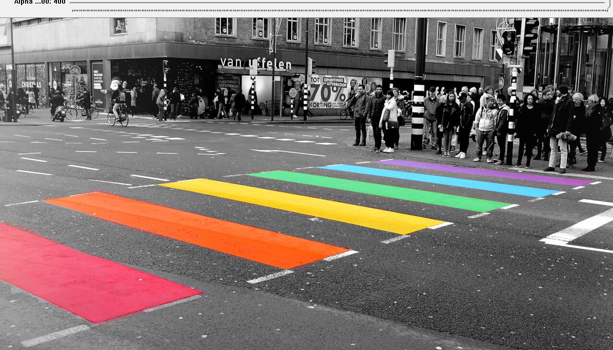
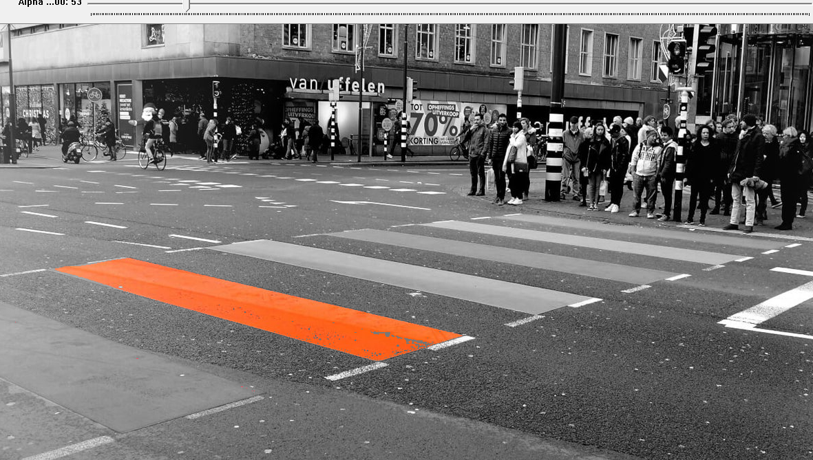
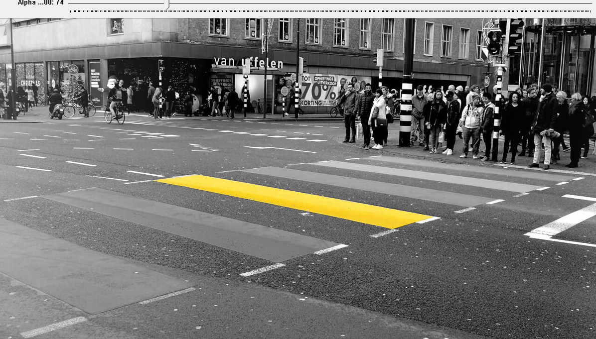
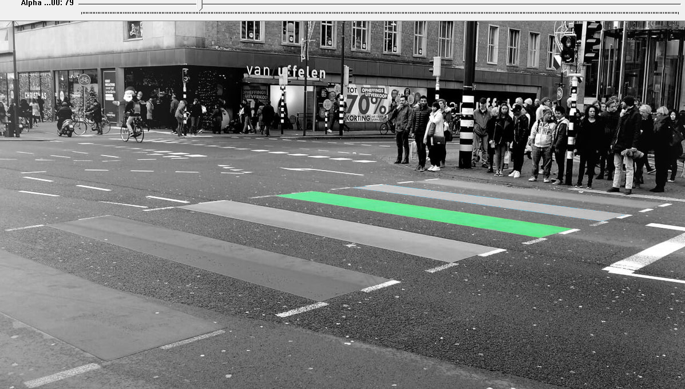

# ROBT310_Image_processing_Project_3
The selective color effect is implemented in this project

Need to install: (here is the [link](https://www.youtube.com/watch?v=l4372qtZ4dc) that will help to install)
1) Visual Studio 2019 
2) OpenCV 3.1

## Description
The homework project 3:
This selective color effect is usually used in tracking applications (finding the red object in a scene and tracking it) or in movies. The aim of selective coloring is highlighting a specific range of colors, while keeping the background in grayscale.

# selective_color_effect

The aim of the project is to implement selective color effect using OpenCV.
The original image is read in the code (in the Visual Studio) and displayed as shown:

Then, using the mouse click you can choose the right color that you want to highlght.
In the following example, the orange color was chosen.

After that, the yellow color was chosen:

Then, the green color was chosen for demonstartion purposes:

